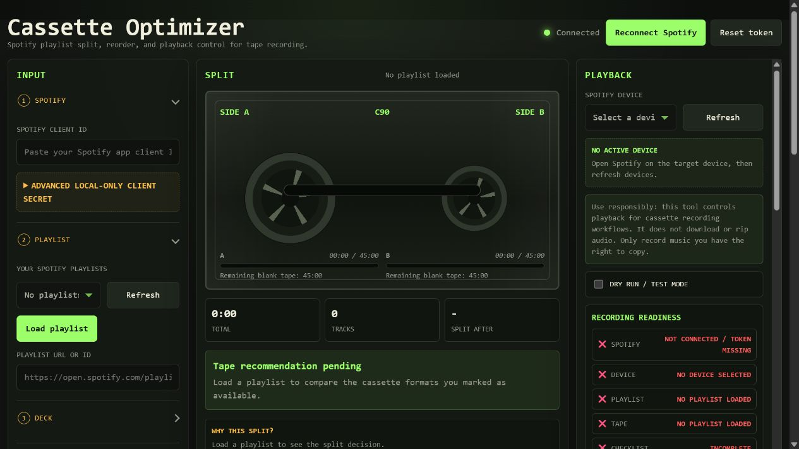
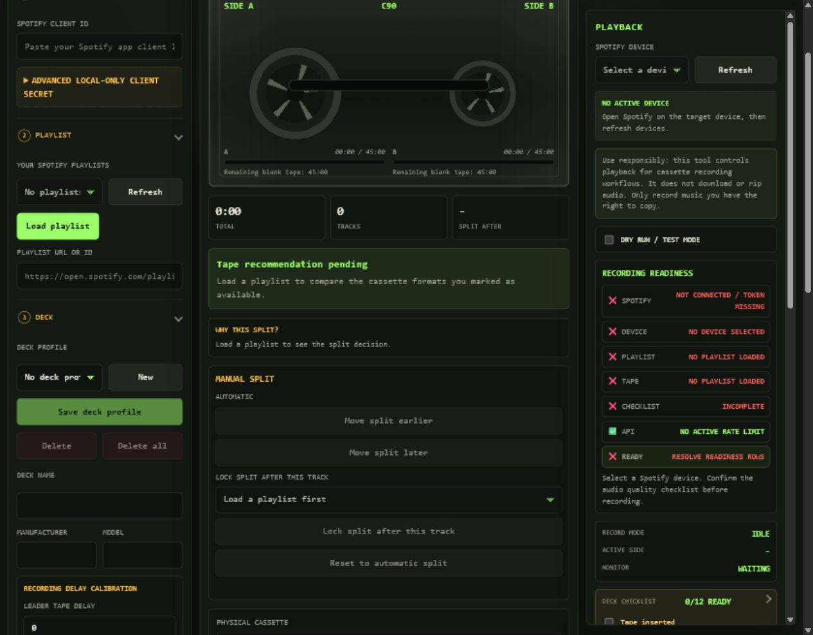
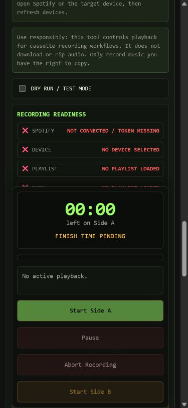

# Cassette Optimizer

A local-first Spotify playlist planner and playback controller for recording mixtapes to cassette.

Cassette Optimizer keeps a Spotify playlist in order, plans it across one or more physical cassettes, shows a recording countdown, and controls Spotify playback so the user can record one side at a time.

## Screenshots







## Documentation

- [docs.md](docs.md) — documentation index.
- [docs/code-overview.md](docs/code-overview.md) — how the code is structured.
- [docs/app-state-and-flow.md](docs/app-state-and-flow.md) — how state moves through the app.
- [docs/module-reference.md](docs/module-reference.md) — file-by-file code reference.
- [docs/ai-usage.md](docs/ai-usage.md) — AI tools used for research, prompting, implementation, and repository maintenance.
- [CHANGELOG.md](CHANGELOG.md) — release notes and feature highlights.
- [TODO.md](TODO.md) — short-lived task list; currently no active implementation tasks.

## Responsible Use

This project is a cassette workflow tool, not a music ripping or redistribution tool.

> [!WARNING]
> You are responsible for complying with Spotify's terms, copyright law, and the rules that apply in your country. Do not use this project to bypass DRM, copy-protection, access controls, or licensing restrictions. Do not distribute recordings unless you have the rights to do so.
>
> For the safest use, record only music you own, created yourself, or are otherwise licensed to copy.

## What it does

- Loads Spotify playlists through OAuth PKCE.
- Plans tracks across one or more cassette tapes without cutting tracks.
- Keeps multi-tape state in a central project model.
- Supports deck profiles, cassette model profiles, exact per-tape cassette model selection, and owned tape inventory quantities.
- Blocks recording when `Tapes you have` cannot satisfy the current plan or any planned side is too long for its cassette format.
- Exports/imports cassette projects as JSON.
- Exports/imports profile folders with deck profiles, cassette profiles, playlist profiles, and tape collection JSON separated into subfolders; unreadable JSON files are skipped with a log entry.
- Migrates older cassette project JSON during import.
- Restores the active project, selected playlist, selected Spotify device, and in-progress recording state after reload or browser close.
- Controls Spotify playback for Side A / Side B recording with preflight safety checks.
- Locks planning controls while cueing, recording, pausing, or waiting for a flip.
- Provides a seven-row Recording Readiness panel and blocks Start Side A/B until all rows are green.
- Provides Dry Run mode with visible simulation logging, recording countdowns, deck readiness guidance, and optional LAN monitoring.
- Handles Spotify 429 rate limits with a Retry-After countdown and recording-safe playback command replay.
- Adds calibration helpers for leader tape delay, motor latency, safety margin, and browser-based level-check tones.
- Prints J-cards with title cleanup, manual print-only title overrides, and cover-derived theme colors.
- Supports explicit tape slack margin tolerance with warnings when unofficial tape length is used.

## Streaming Service Support

Spotify is fully supported. Cassette Optimizer uses PKCE OAuth and does not require a backend.

YouTube Music is on the roadmap. YouTube Music has no official public API for playlist access in the same way Spotify does. Implementation would require a contributor familiar with unofficial approaches or the YouTube Data API v3 workarounds. Open a GitHub issue if you want to help.

Tidal is on the roadmap. Tidal has a developer API, but the maintainer does not use Tidal. A contributor with an active Tidal account and API access is needed. Open a GitHub issue if you want to help.

Apple Music is on the roadmap. Support requires MusicKit JS and an Apple Developer account for testing. The maintainer does not own Apple devices. A contributor who uses Apple Music and has developer access is needed. Open a GitHub issue if you want to help.

Contributions from people who actually use these services are more valuable than speculative implementations.

For implementation details, read [docs/code-overview.md](docs/code-overview.md) and [docs/module-reference.md](docs/module-reference.md).

## Local Setup

### Windows portable download

For Windows users who do not want to install Node.js or run npm commands, download the `CassetteOptimizer-*-windows-x64-portable.zip` file from the latest GitHub release.

1. Extract the ZIP.
2. Double-click `Cassette Optimizer.exe`.
3. Your browser opens `http://127.0.0.1:8787/`.
4. Keep the launcher window open while using the app.
5. Close the launcher window to stop the app.

Before clicking `Connect Spotify`, create your own Spotify app Client ID, add `http://127.0.0.1:8787/callback` as the redirect URI, and paste the Client ID into the app. The portable `.exe` removes the Node/npm setup, but Spotify still requires your own Client ID.

### Developer setup

Use Node.js 18 or newer for the local server and automated tests.

Create or open a Spotify app in the Spotify Developer Dashboard and add this redirect URI:

```text
http://127.0.0.1:8787/callback
```

If you use Tailscale Serve, also add the exact HTTPS Tailscale callback URL, for example:

```text
https://der-dicke.tenrec-typhon.ts.net/callback
```

Start the local server on Windows, Linux, or macOS:

```sh
npm run start:local
```

Windows PowerShell convenience script:

```powershell
.\scripts\start-local.ps1
```

Linux/macOS convenience script:

```sh
./scripts/start-local.sh
```

Or manually with Python:

```sh
python -m http.server 8787 --bind 127.0.0.1
```

Open:

```text
http://127.0.0.1:8787/
```

Do not use `file://` for Spotify login. OAuth PKCE requires the local HTTP origin, and the server must stay running until Spotify redirects back to `/callback`.

## LAN Monitor Mode

For monitoring from another device on the same network, use the optional Node server:

```sh
npm run start:lan
```

PowerShell and POSIX shell convenience scripts are also available:

```powershell
.\scripts\start-lan.ps1
```

```sh
./scripts/start-lan.sh
```

They serve the same app on all network interfaces and add a small `/api/status` endpoint. Open the printed LAN URL on another device to monitor the current playback status.

LAN clients are monitor-only. Spotify OAuth and playback control must be done from `http://127.0.0.1:8787` on the host machine.

`GET /api/status` stays readable on LAN for monitor devices. `POST /api/status` is accepted from localhost automatically; non-local writers must send `x-status-write-token` matching the optional `STATUS_WRITE_TOKEN` environment variable, otherwise the server returns `403`.

> [!WARNING]
> Keep the LAN server on a trusted private network only. Do not expose it directly to the public internet.

## Tailscale Serve Control Mode

Tailscale Serve can expose the local app over your private tailnet with HTTPS:

```sh
npm run start:lan
tailscale serve 8787
```

Open the printed `https://...ts.net/` URL on a tailnet device. Unlike plain LAN/IP access, Tailscale HTTPS is allowed to show Spotify login and playback controls.

Spotify tokens are stored per browser origin. Being connected on `http://127.0.0.1:8787` does not connect `https://...ts.net/`; click `Connect Spotify` on the Tailscale URL once.

Client Secret auth remains disabled on Tailscale. Use normal PKCE with your Spotify Client ID.

## Spotify App Configuration

Create your own Spotify app and paste its Client ID into the app UI before clicking `Connect Spotify`. The repository does not ship with a default Client ID.

Minimum Spotify setup:

1. Open the Spotify Developer Dashboard.
2. Create an app.
3. Add this Redirect URI exactly:

```text
http://127.0.0.1:8787/callback
```

4. Save the Spotify app settings.
5. Copy the app's Client ID.
6. Paste it into `Spotify Client ID` in Cassette Optimizer.
7. Click `Connect Spotify`.

If `Connect Spotify` is clicked before a Client ID is entered, the app now shows an inline setup error below `Spotify Client ID`, focuses the field, and also logs `Add your Spotify Client ID first.`

The app defaults to OAuth PKCE without a Client Secret. The optional Client Secret field is advanced, local-only, and should not be used on public hosting or LAN devices.

Do not add Spotify Client IDs, client secrets, GitHub tokens, OAuth access tokens, or refresh tokens to the repository.

Required scopes:

```text
playlist-read-private
playlist-read-collaborative
playlist-modify-private
playlist-modify-public
user-read-playback-state
user-modify-playback-state
```

## Quick Start

1. Open `http://127.0.0.1:8787/`.
2. Create or open a Spotify Developer app, add `http://127.0.0.1:8787/callback` as a redirect URI, and paste the app's Client ID into `Spotify Client ID`.
3. Click `Connect Spotify`.
4. Refresh your playlists, choose one or paste a playlist URL/ID, then click `Load playlist`.
5. Add the physical tapes you own under `Tapes you have`, choose a tape format, and review the Side A / Side B split.
6. Refresh Spotify devices, choose the target device, complete or skip the deck checklist, and wait until Recording Readiness is green.
7. Click `Start Side A`, start the deck when `PRESS RECORD NOW` appears, then flip and continue with `Start Side B`.

## Recording Workflow Details

- Deck profiles store recorder timing and capability fields: leader tape delay, motor latency, safety margin, default slack margin, Dolby NR, Type II/IV support, auto recording level, and notes.
- Cassette profiles describe reusable tape models. They do not add inventory by themselves; use the plus controls under `Tapes you have` to add real physical copies.
- Multi-tape plans can assign an exact owned cassette model to each physical tape when matching copies are available.
- The Tape row in Recording Readiness turns red when inventory is empty, short of the required formats, or too small for a planned side.
- `Tape Slack Margin (seconds)` intentionally allows unofficial headroom and shows warnings when the plan relies on it.
- The Level Check tone is optional. Turn deck input gain down before starting it, raise levels slowly, and stop the tone before recording.
- For multi-tape projects, choose the next physical cassette from the plan selector and repeat Side A / Side B.

Playlist loading uses Spotify's current playlist items API and follows paging beyond the first 100 items, so long owned or collaborative playlists can be planned as one project. If Spotify allows playlist metadata but blocks track items for a public playlist owned by another account, the app keeps the playlist title/art visible and shows `No readable tracks`; cassette planning and recording remain blocked because track durations and URIs are not available.

## Reload and Close Recovery

The app autosaves the active cassette project in browser storage after load/import and after project changes. Reloading or closing and reopening the same browser origin restores the playlist title, playlist input/dropdown selection, tracks, selected tape, split plan, tape minutes, J-card data, and selected Spotify device snapshot.

If a recording was active, the app also restores the recording mode, active side, elapsed side time, Spotify progress anchor, selected tape index, and tape length. A running side resumes its local timer by adding the wall-clock time since the last saved snapshot. Paused, cue, and flip states restore into their corresponding safe UI state. Abort, loading a different project, and completed Side B clear the saved recording state so stale sessions do not reappear.

This recovery is local to the browser and origin. It does not store Spotify client secrets by default, does not store audio, and does not persist anything on the LAN status server.

## Profiles and Tape Collection

Deck profiles store recorder-specific timing and capability fields: name, manufacturer, model, recording delay calibration (`leaderTapeDelay`, `motorLatency`, `safetyMargin`), default slack margin, optional auto recording level, Dolby NR, Type II support, Type IV support, and notes. Deck profile JSON keeps those delay values both as top-level fields and inside `recordingDelayCalibration` for readable exports.

Cassette profiles store reusable cassette model fields: name, manufacturer, model, type, length, optional year, condition flags, leader offset, and slack override. Cassette profiles are model definitions only. Use the plus/minus controls under `Tapes you have` to add or remove the physical cassette copies you actually own.

Fast edits to timing, deck profile, and cassette profile inputs are batched for rendering and storage; the current in-memory timing state still updates immediately.

When a plan uses multiple physical tapes, each tape can select an exact owned cassette model from the dropdown. The dropdown only offers models that match the selected tape length and available owned copies.

Use `Export profiles` / `Import profiles` for a single JSON profile bundle. Use `Export profile folder` / `Import profile folder` to keep all local config surfaces split into JSON files under `profiles/deck-profiles`, `profiles/cassette-profiles`, `profiles/playlist-profiles`, and `profiles/tape-collection`.

Recording Readiness has seven rows:

| Row | Ready when |
| --- | --- |
| Spotify | Token is valid |
| Device | Explicit Spotify device is selected, or Dry Run is active |
| Playlist | At least one track is loaded |
| Tape | Inventory and plan are valid |
| Checklist | All deck checklist items are complete or explicitly skipped |
| API | No active rate limit or non-retryable API error exists |
| Ready | All rows above are green |

Start Side A/B is disabled, and the click handler also blocks, unless every Recording Readiness row is green.

## UI and Accessibility

The Input panel is organized as collapsible workflow sections: Spotify, Playlist, Deck, Cassette, Tape planning, and Files. Spotify, Playlist, and Tape planning start open because they are the common setup path; Deck, Cassette, and Files can be opened when editing profiles or importing/exporting data.

The page includes a keyboard skip link to jump directly to `Recording controls`. Interactive controls have visible focus rings, the deck checklist is collapsible, and the recording controls are grouped in one focusable region.

On phone-sized screens the app tightens spacing, stacks form rows, uses larger tap targets, and keeps the recording controls sticky near the bottom of the viewport so Start, Pause, Abort, cue, flip, and Side B controls remain reachable during recording.

`Apply to Spotify` always asks for confirmation before changing the remote playlist order. `Export Backup` downloads the project JSON and does not continue with the Spotify reorder. Playlists above 100 tracks show an extra warning because Spotify receives the update in batches.

## Deck and Audio Setup

Use a clean line-level path from your Spotify playback device to the cassette deck.

```text
Spotify device / DAC / headphone output
        ↓
cassette deck LINE IN / AUX IN / REC IN
        ↓
deck monitor output / headphones / speakers
```

For the best recording quality, use the Spotify desktop app when possible. Desktop playback is the most likely path to expose exclusive, fixed-volume, or direct hardware output modes through your operating system or audio interface; browser and mobile playback may not offer the same output control.

Before a real recording run:

- Select the exact Spotify output device you will record from.
- Prefer the Spotify desktop app for the recording source when your setup supports it.
- Set Spotify Streaming quality to Lossless if available, otherwise choose the highest available quality.
- Turn Auto-adjust quality, Crossfade, Normalize volume, Spotify EQ, and system sound enhancements off.
- Use the same output device in Spotify and your operating system mixer.
- Enable exclusive, fixed-volume, or direct hardware output for that device if available.
- Set system output volume to 100% / maximum.
- Adjust final recording level on the cassette deck input, not with OS mixer volume.
- Disable notification sounds before recording.
- Watch the deck meters and avoid clipping or distortion.
- The deck checklist gates Start Side A/B unless all items are checked or `Skip checklist` is active. The Spotify device row can be checked automatically only after an explicit current Spotify device selection.
- If using `Leader Tape Delay`, the cue phase shows `Advancing past leader tape...` while the shared cue delay pipeline runs.
- The Level Check section has seven informational checkpoints: Spotify Lossless/highest quality, Crossfade 0 s, Normalize off, EQ off, system volume 100 %, deck in record-pause, and peaks clean/no clipping.
- The browser `Level Check` source can play 400 Hz, 1 kHz, or pink noise at `-12 dBFS`, `-6 dBFS`, or `0 dBFS`; it never auto-starts and must be stopped manually.

## Dry Run and Rate Limits

Dry Run simulates the recording flow without Spotify playback API calls. The cue countdown, leader/motor delays, side timers, flip prompt, and completion state still run at real speed. A visible DRY RUN banner and log show the playback commands that would have been sent.

Spotify Web API 429 responses are handled centrally. Outside recording, the app waits for `Retry-After` and retries once. During active recording, playback commands are buffered and replayed only if the same side is still active after the wait; the tape countdown is not interrupted.

When the Retry-After countdown ends or a replay fails, the app clears the active rate-limit state so controls do not stay disabled indefinitely.

## Regression Tests

Run the automated test suite:

```sh
npm test
```

Optional lightweight playback regression checks:

```sh
node scratch/test_playback.cjs
```

Run the project model / export-import regression checks:

```sh
node scratch/test_project_model.cjs
```

For manual checklists:

- [docs/j-card-print-regression.md](docs/j-card-print-regression.md)
- [docs/audio-setup-regression.md](docs/audio-setup-regression.md)

## Troubleshooting

- `Connect Spotify` shows a Client ID error: paste your Spotify app Client ID into `Spotify Client ID` first. The app keeps the error visible until you enter a value.
- Spotify says the redirect URI is invalid: add `http://127.0.0.1:8787/callback` exactly to your Spotify app settings, save the Spotify app, then click `Connect Spotify` again.
- `ERR_CONNECTION_REFUSED` after Spotify login: start `npm run start:local` and reload the callback URL.
- `OAuth callback rejected`: start from `http://127.0.0.1:8787/` and connect again.
- Reload restored the project but Device is red: open Spotify on the target device, click `Refresh` under `Spotify device`, and reselect it if the saved device snapshot no longer matches a current Spotify Connect device.
- `No active Spotify device found`: open Spotify on desktop/mobile, start playback once, then retry.
- Wrong target device: click `Refresh` under `Spotify device`, select the intended Spotify Connect device, then retry.
- Recording Readiness Tape row is red: add the missing cassette quantity under `Tapes you have`, choose a larger format, or adjust the plan so every side fits.
- Playback command sent but Spotify stays idle: wake the target Spotify device by playing any song, then retry or pause/resume the side.
- Rate limited: wait for the app's retry countdown in the Recording Readiness panel.
- Expired token: reconnect Spotify and refresh devices.
- Playlist list is empty: reconnect Spotify and ensure the token has `playlist-read-private`.
- Playlist loads but shows `No readable tracks`: Spotify allowed playlist metadata but did not allow this token to read the track items. Use an owned or collaborative playlist, duplicate the public playlist into your library/account, or choose a playlist whose items Spotify exposes to your token.
- Connect Spotify not visible on plain phone/LAN IP: this is by design. Open `http://127.0.0.1:8787` on the host machine, or use Tailscale Serve with the `https://...ts.net/callback` redirect URI registered in Spotify.
- Tailscale URL shows disconnected: tokens are per origin; connect Spotify again on the `https://...ts.net/` URL.

## Security

- Do not commit secrets.
- Do not commit Spotify access/refresh tokens.
- Do not commit GitHub tokens.
- Keep the app local unless you have reviewed the OAuth redirect URI and public-hosting implications.

## License

MIT. See [LICENSE](LICENSE).
